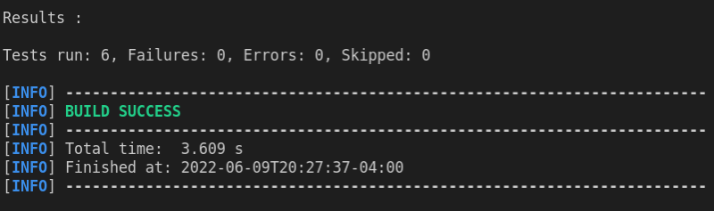
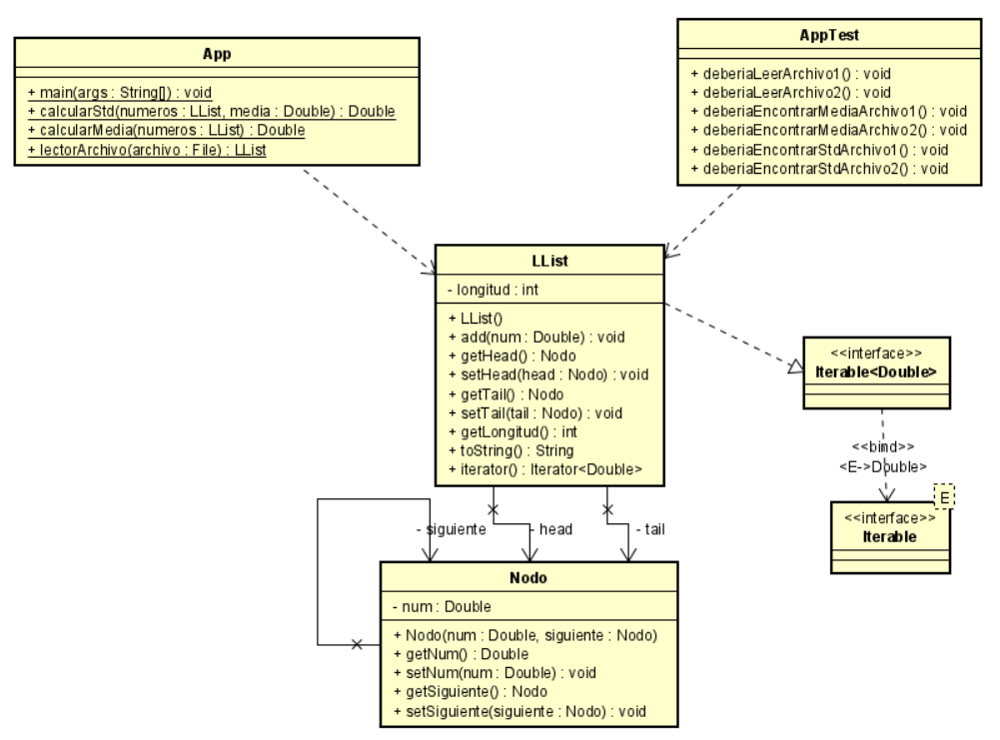

# Titulo

OO Design Assignment Kit

## Descripción

En este repositorio se encontrará un programa en java el cual le permitirá dado un archivo con números encontrar la media y la desviación estándar de los números presentes en el archivo.

También encontrara una implementación propia de una LinkedList.

### LOC/h

Para este taller se hicieron 197 líneas de código, en 3 horas.

**65.67 LOC/h**

### Prerrequisitos

Para correr este se debe tener instalado:

- Maven
- Java

### Guía de uso

Para compilar el proyecto se debe usar:

```
mvn package
```

Para ejecutarlo, se debe hacer de la siguiente forma

```
$ java -cp "target\classes" edu.escuelaing.arem.ASE.app.App [Archivo]
```

El archivo debe tener la estructura como en los siguientes archivos:

- [Archivo 1](num1.txt)
- [Archivo 2](num2.txt)

## Ejecutar Test

Para ejecutar los test, en la consola se debe ejecutar el siguiente comando:

```
mvn test
```

### Explicación test

En cuanto a las pruebas, se tienen 6, en las cuales se prueban los 3 métodos de la clase App y los 2 archivos encontrados en el repositorio.

### Reporte de Pruebas



## Documentación

Para visualizar la documentación se debe ejecutar el siguiente comando:

```
mvn javadoc:javadoc
```

Una vez se realice este comando, se debe buscar en la siguiente ruta "target\site\apidocs\index.html"

## Estructura de Archivos

    .
    |____pom.xml
    |____src
    | |____main
    | | |____java
    | | | |____edu
    | | | | |____escuelaing
    | | | | | |____arem
    | | | | | | |____ASE
    | | | | | | | |____app
    | | | | | | | | |____App.java
    | | | | | | | | |____LList.java
    | | | | | | | | |____Nodo.java
    | |____test
    | | |____java
    | | | |____edu
    | | | | |____escuelaing
    | | | | | |____arem
    | | | | | | |____ASE
    | | | | | | | |____app
    | | | | | | | | |____App.java

## Diagrama de Clases



## Construido con

- [Maven](https://maven.apache.org/) - Dependency Management
- [Java](https://www.java.com/es/) - Progamming Language

## Autor

- **Juan Carlos Baez Lizarazo** - [juanbaezl](https://github.com/juanbaezl)

## Fecha

10 de Junio, 2022

## Licencia

Para más información ver: [LICENSE.txt](LICENSE.txt)
